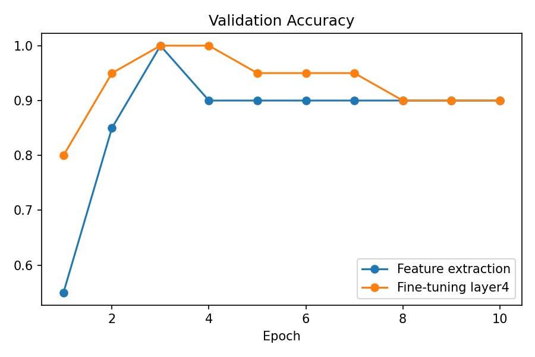

# Transfer Learning: Klasifikasi Sendok vs Garpu

## Dataset
100 foto kamera HP (50 spoon, 50 fork) di folder `spoon/` dan `fork/`, metadata di `metadata.csv`.
Split acak (seed 42): 80 train, 20 validation. Resize 224x224, normalisasi ImageNet.

## Model
ResNet-50 pretrained ImageNet, classifier diganti menjadi 2 output.

| Metode | Val acc akhir | Val acc terbaik | Val loss akhir | Waktu |
|---|---|---|---|---|
| Feature extraction | 90% | 100% (epoch 3) | 0.436 | 9.9 s |
| Fine-tuning layer4 | 90% | 100% (epoch 3-4) | 0.136 | 8.3 s |

## Analisis
Fine-tuning layer4 belajar lebih cepat dan val loss lebih rendah, tetapi mulai overfitting
setelah epoch 6 (val loss naik, train acc 100%). Feature extraction lebih stabil.

## Keterbatasan
Validation hanya 20 foto, sehingga 1 foto salah = 5%. Selisih akurasi antar metode
belum cukup untuk disimpulkan signifikan. Perlu lebih banyak data untuk evaluasi yang andal.

## Cara menjalankan
Buka `transfer-learning/notebook.ipynb` di Google Colab, aktifkan GPU, jalankan semua cell.

