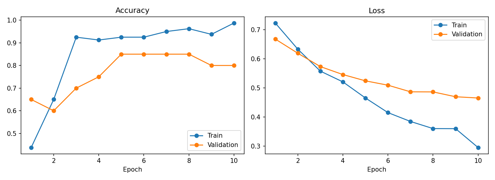

# Transfer Learning: Klasifikasi Sendok vs Garpu

## Dataset
100 foto (50 spoon, 50 fork) di folder `spoon/` dan `fork/`, metadata di `metadata.csv`.
Split acak (seed 42): 80 train, 20 validation. Resize 224x224, normalisasi ImageNet.

## Model
ResNet-50 pretrained ImageNet dengan metode **feature extraction**: seluruh bobot ResNet
dibekukan, hanya classifier baru (2 output: spoon/fork) yang dilatih.
Optimizer Adam (lr 0.001), batch size 16, 10 epoch.
Hasil di bawah berasal dari run terakhir (output tersimpan di notebook).

| Parameter | Hasil |
|---|---|
| Akurasi Training akhir | 97,5% |
| Akurasi Validation akhir | 90% |
| Akurasi Validation terbaik | 95% (epoch 3-5, 7, 9) |
| Validation loss akhir | 0.418 |
| Waktu training (10 epoch) | 7.3 s |
| Latensi inferensi (CPU) | min 118.9 ms, rata-rata 139.3 ms, maks 196.2 ms |

## Analisis
Seed PyTorch tidak dikunci, sehingga angka tiap run berbeda. Karena itu analisis berfokus
pada pola, bukan angka persis.

- **Model belajar:** train acc naik dari 53,75% (epoch 1, mendekati tebakan acak) ke 97,5%,
  dan val loss turun terus dari 0.652 ke 0.418. Ini menandakan classifier baru berhasil
  memanfaatkan fitur ImageNet untuk membedakan sendok dan garpu.
- **Akurasi validation:** naik dari 70% ke 95% pada epoch 3, lalu bergerak antara 90% dan 95%
  hingga epoch 10. Dengan 20 foto validation, naik-turun itu setara 1 foto (5%) dan masih
  tergolong fluktuasi. Pada run-run sebelumnya, val acc akhir berkisar 80-90%, sehingga hasil
  akhir yang andal berada di sekitar 80-95%, bukan satu angka tetap.
- **Jarak train-validation:** train acc (97,5%) sedikit di atas val acc (90%), tetapi val loss
  terus turun sehingga belum ada tanda overfitting yang jelas.
- **Waktu training:** 10 epoch selesai dalam sekitar 7 detik karena hanya classifier yang
  dilatih dan GPU dipakai.
- **Latensi inferensi:** diukur di CPU sebagai waktu model menebak satu foto (100 kali tebakan
  setelah 10 kali pemanasan). Rata-ratanya 139.3 ms per foto, atau sekitar 7 foto per detik.
  Selisih antara min (118.9 ms) dan maks (196.2 ms) cukup lebar, kemungkinan karena CPU Colab
  dipakai bersama dan beban sistem berubah-ubah. Latensi ini hanya menghitung waktu model
  (forward pass); waktu membaca file foto dan resize/normalisasi belum termasuk, sehingga
  waktu nyata di aplikasi akan lebih lama.
- **Kesimpulan:** feature extraction dengan ResNet-50 pretrained sudah cukup untuk
  mengklasifikasi sendok dan garpu dengan akurasi validation sekitar 90-95% pada dataset kecil
  ini, dengan waktu training yang sangat singkat. Latensi inferensi di CPU sekitar 0,14 detik
  per foto, cukup untuk penggunaan non-real-time. Hasil bisa ditingkatkan dengan lebih banyak
  data atau fine-tuning sebagian layer.

## Keterbatasan
Validation hanya 20 foto, sehingga 1 foto salah = 5%. Eksperimen dijalankan beberapa kali tanpa
mengunci seed, sehingga hasilnya bervariasi. Tidak ada test set terpisah. Pengulangan dengan
beberapa seed dan test set akan memberi evaluasi yang lebih andal. Latensi diukur pada CPU
Intel Xeon 2.00 GHz (Google Colab), pada satu input acak 224x224, tanpa memasukkan waktu
pemuatan dan pra-pemrosesan foto, sehingga angkanya bisa berbeda di perangkat lain.

## Cara menjalankan
Buka `transfer-learning/notebook.ipynb` di Google Colab, aktifkan GPU, jalankan semua cell.

